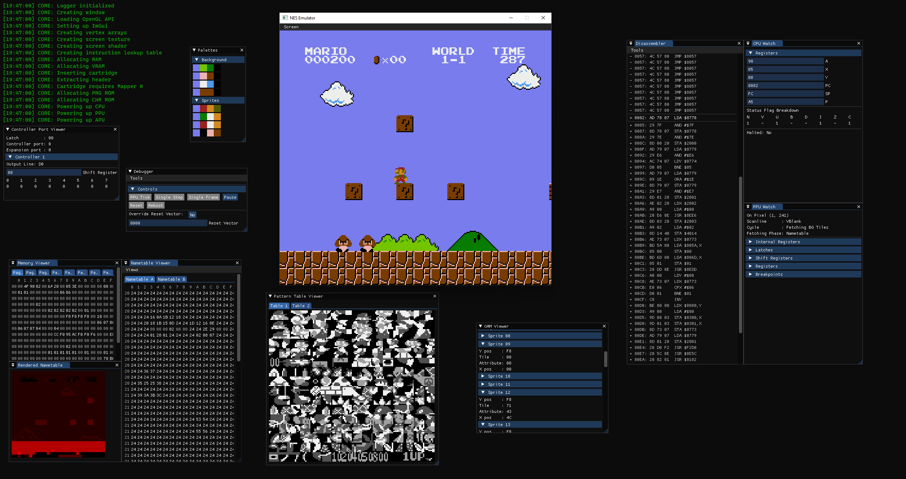

# NESemu

NESemu is my fourth attempt at writing a working Nintendo NES Emulator.

This time I'm also writing a Debugger that will hopefully help me finish the project.

Also I'm writing it in C++ this time because jesus christ i hate C. My previous attempt is [here](https://github.com/Lauchmelder23/NESEmulator).

## Libraries
* [spdlog](https://github.com/gabime/spdlog) for logging
* [GLFW](https://github.com/glfw/glfw) for window and event handling
* [GLAD](https://glad.dav1d.de/) to load OpenGL
* [ImGui](https://github.com/ocornut/imgui) for the GUI

## Resources
* [Nesdev Wiki](https://wiki.nesdev.org/w/index.php) - Probably the most exhaustive NES documentation available on the internet
* [Masswerk](https://www.masswerk.at/6502/6502_instruction_set.html) - Exhaustive list of official and illegal instructions (there are some errors regarding the cycles of illegal opcodes)